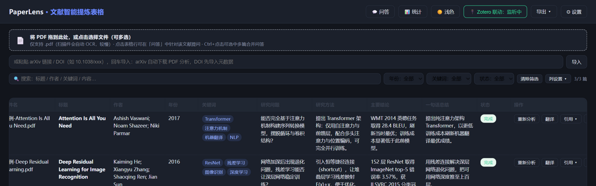

# SiftLit · Web 工程版（npm 分支）

> **本仓库是 SiftLit 主项目的额外版本（Web 工程版）。**
> 主版本把整个应用实现在单个 `index.html` 里，配一个 Python `app.py` 做本地中转服务，并可用 PyInstaller 打包成 `.exe`；
> 本分支把前端重构为标准 Vite 工程，并把本地能力（Zotero 联动、AI 同源转发）**整合为一个 Node 单进程服务**，
> 定位是「可构建、可维护、纯 Node、无 Python 依赖」的 Web 版本，**不做 `.exe` 打包**。


---

## 1. 它做什么

拖入 PDF → 自动解析文本（扫描件走 OCR）→ 调用大模型按固定 Schema 提炼 **11 个结构化字段** → 生成可筛选、可编辑、可导出的文献表格；支持文献问答、中英翻译、Zotero 联动与 arXiv / DOI 导入。

所有数据只留在本机：**AI Key 仅存浏览器，表格与 PDF 全文存本地存储，无任何遥测。**

## 2. 与主版本的区别

| 维度               | 主版本（原单文件版）                 | 本分支（Web 工程版）                                                  |
| ------------------ | ------------------------------------ | --------------------------------------------------------------------- |
| 前端形态           | 单个 `index.html`（约 1870 行）      | Vite 工程（`src/` 按 contract/core/storage/bridge/ai/domain/ui 分层） |
| 本地中转服务       | Python `app.py`（独立进程，:`3002`） | Node `server/`（**与页面同进程同源**，默认 `:4173`）                  |
| 运行时依赖         | Node + Python                        | **仅 Node**                                                           |
| CORS 保障连接      | `proxy.js`（已弃用）→ `app.py /ai`   | 同源 `/ai` 转发，无跨域                                               |
| pdf.js / tesseract | CDN 引入                             | npm 依赖 + **资源本地化**（离线 OCR）                                 |
| 打包               | PyInstaller `.exe`                   | 静态站点 + Node 服务（**不做 exe**）                                  |
| 构建               | 无                                   | `npm run build`                                                       |

功能行为与主版本对齐（同一套 UI 与交互）；差异只在工程结构与运行时。

## 3. 功能特性

- **PDF 解析**：pdf.js v4 提取文字层；**当遇到特殊 PDF（扫描件 / 图片型 PDF，即没有可选中文字层）时，自动用 tesseract.js OCR 兜底**（语言包本地化，可离线）。
- **AI 提炼**：6 家服务商（智谱 GLM / DeepSeek / 通义千问 / OpenAI / Gemini / Claude），11 字段固定输出。
- **表格**：搜索、按年份/关键词/状态筛选、明细展开、**双击单元格就地编辑**、列设置、统计面板。
- **文献问答**：点选一行提问，`Ctrl/⌘ + 点击`多选可合并对比问答。
- **翻译**：一键把标题/研究问题/方法/结论/总结译成中文（可撤销恢复原文）。
- **引用**：GB/T 7714 与 APA，一键复制。
- **导入导出**：导出 CSV（Excel 直开）/ Markdown / JSON 备份（含全文），支持备份导入恢复。
- **链接导入**：粘贴 arXiv 链接自动下载 PDF；粘贴 DOI 自动取 Crossref 元数据。
- **Zotero 联动**：在 Zotero 里点选文献，页面自动抓取并分析（见 §7）。
- **暗黑模式**、隐私优先（数据不出本机）。

## 4. 环境要求

- **Node.js ≥ 18**（依赖内置 `fetch` 与 `AbortSignal.timeout`；推荐 20 / 22）。
- 无需 Python。
- 浏览器 Chrome / Edge / Firefox / Safari 均可。

## 5. 快速开始

```bash
# 1) 安装依赖（postinstall 会自动把 tesseract 的 worker/wasm 拷到 public/ocr）
npm install

# 2) 下载 OCR 语言包（中文 + 英文，约 31MB；离线 OCR 必需，见 §6）
npm run ocr:fetch

# 3) 启动
npm run dev          # 开发：http://localhost:5173 （页面 + 本地桥，单进程同源）
```

生产部署：

```bash
npm run build        # 产出 dist/
npm start            # 托管 dist/ + 本地桥 → http://127.0.0.1:4173
```

也可用 `npm run preview` 预览构建产物（同样带桥）。



## 6. OCR 语言包（重要）

> **OCR 是用来处理非文本型PDF。** 大多数 PDF（由 Word/LaTeX 导出）自带文字层，pdf.js 直接抽取即可，无需 OCR。但**扫描件 / 图片型 PDF 本质是图片、没有可选中文字层**，pdf.js 抽不到字，此时才需要 tesseract.js 做光学字符识别（OCR）把图上的字变成文本。OCR 依赖"语言包"（每种语言一份模型），本项目内置英文（`eng`）与简体中文（`chi_sim`）。

`public/ocr/` 下的 `worker.min.js` / `tesseract-core*.wasm.js` / `*.traineddata.gz` 都是**生成物，不入库**：

- `npm install` 的 `postinstall` 负责拷 worker/wasm；
- **语言包必须执行 `npm run ocr:fetch`**（或手动放入 `public/ocr/`）。

缺失语言包时，文字层 PDF 不受影响，但**扫描件 OCR 首次会联网**从 CDN 拉取。详见 `public/ocr/README.md`。

## 7. 使用说明

1. **配置 AI Key**：右上角「设置」→ 选服务商 → 填 API Key 与模型 → 保存。默认智谱 GLM（`glm-4-flash` 系列免费）。
2. **导入文献**：拖入 / 点击选择 PDF（可多选），或粘贴 arXiv / DOI 链接。
3. 每条记录会经历「解析中 → AI 分析中 → 完成」，状态徽章带逐页进度条。
4. **点选一行**打开右侧问答面板提问；`Ctrl/⌘ + 点击`多选可合并提问。
5. **双击**任意单元格可就地编辑（`Ctrl/⌘ + Enter` 或失焦提交，`Esc` 取消）。
6. 「导出」下拉可选 CSV / Markdown / JSON 备份；「列设置」控制行内列与明细字段。
7. 右上角图标切换深色/浅色，选择会被记住。

### Zotero 联动（可选）

在 Zotero 里点选文献即自动分析。**一次性前置配置：**

1. Zotero 正在运行，且「设置 → 高级」已勾选 **允许其他应用程序与 Zotero 通信**；
2. 安装 **Better BibTeX** 插件（用于读取"当前选中项"，官方 API 无此接口）并重启 Zotero；
3. 开启 Zotero 本地只读 API —— 菜单「工具 → 开发者 → Run JavaScript」执行后重启：

   ```js
   Zotero.Prefs.set("httpServer.localAPI.enabled", true)
   ```

**使用**：页面右上角点「Zotero」→ 按钮变为"Zotero 监听中"→ 在 Zotero 中选中一篇**带 PDF 附件**的文献 → 约 2.5 秒内页面自动新增并分析。

排错对照：

| 现象                 | 原因                 | 处理                    |
| -------------------- | -------------------- | ----------------------- |
| `zotero_offline`     | Zotero 未运行        | 启动 Zotero             |
| `bbt_missing`        | Better BibTeX 未就绪 | 安装/重启 BBT           |
| `local_api_disabled` | 本地 API 未开        | 按上面第 3 条开启后重启 |
| `no_selection`       | 未选中条目           | 在 Zotero 里选一篇      |
| `no_pdf`             | 条目没有 PDF 附件    | 为其挂上 PDF 附件       |

> Zotero 的本地服务只监听 `127.0.0.1:23119`，桥也只接受本机来源的请求；外部网站无法读取你的 Zotero 数据。

## 9. 目录结构

```
SiftLit-web-version/
├── index.html              # Vite 入口
├── vite.config.js          # 构建配置 + 桥中间件（dev/preview 同源提供桥）
├── server/                 # Node 本地服务（生产与 dev 共用）
│   ├── bridge.mjs          #   Zotero 联动 + /ai/<host> 同源转发
│   ├── static.mjs          #   dist/ 静态托管（SPA fallback、穿越防护）
│   └── index.mjs           #   生产入口：node server/index.mjs
├── src/
│   ├── main.js             # 入口：渲染骨架 + 启动
│   ├── contract/           # 字段模型、错误码、校验
│   ├── core/               # 状态 store、串行队列、运行时上下文、启动
│   ├── storage/            # localStorage + IndexedDB（全文）
│   ├── bridge/             # 桥客户端（http / none，按可用性切换）
│   ├── ai/                 # 服务商表、请求客户端、响应解析
│   ├── domain/             # 记录、PDF/OCR、arXiv·DOI、引用、导出
│   ├── ui/                 # 骨架、行渲染、筛选、问答、设置、统计、Zotero
│   └── styles/             # 设计令牌（明/暗）与组件样式
├── scripts/                # postinstall 拷贝资源 / 语言包下载
├── public/ocr/             # OCR 本地资源（生成物，不入库；只保留 README）
├── docs/                   # 截图与 Logo
└── dist/                   # 构建产物
```

## 10. 隐私与安全

- API Key 只存浏览器 `localStorage`，由本地服务转发给你所选的服务商，不经任何第三方中转。
- 表格数据存 `localStorage`、PDF 全文存 `IndexedDB`，均在你自己机器上。
- `/ai` 转发带 **服务商域名白名单**，且桥仅接受本机来源请求，避免被当作开放代理。

## 11. 常见问题

- **AI 报"浏览器直连被 CORS 拦截"**：说明没通过本地服务打开页面。请用 `npm run dev` 或 `npm run build && npm start`，而不是直接打开 `dist/index.html`。
- **页面能开但没有 Zotero**：确认是按本地服务方式启动的（静态托管模式无法访问本机 Zotero）。
- **扫描件 OCR 卡住/失败**：确认已执行 `npm run ocr:fetch`。
- **表格数据丢失**：浏览器存储配额超限时会提示，请及时用「导出 → 备份(JSON)」。

## 12. 许可证

沿用主项目许可证：**MIT License © 2026 PaperLens Authors**。
（若本目录缺少 `LICENSE` 文件，请从主版本拷贝一份以保持完整。）
