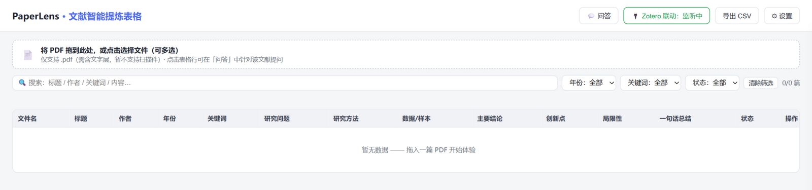
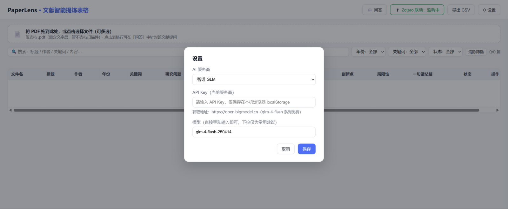

# PaperLens 🔍 · 文献智能提炼表格

> 把文献 PDF 拖进浏览器，AI 自动提炼成一张结构化表格：研究问题、方法、数据样本、主要结论、创新点、局限性……一目了然。

  



多 AI 服务商配置——每家的 Key 和模型分别保存，随时切换：



## 这是什么

读文献时经常需要把几十篇论文整理成文献综述表格（研究问题 / 方法 / 结论……），逐篇手摘非常耗时。PaperLens 把这件事压缩成两步：**拖入 PDF → AI 提炼**，并在本地浏览器里生成可编辑、可筛选、可导出的表格。

- **纯本地运行**：只有一个本地静态服务，分析结果存在浏览器 localStorage，不上传任何服务器；
- **自带 API Key**：直接在浏览器里调用你自己的大模型 API Key（支持 6 家服务商），密钥只存在本机；
- **Zotero 联动**：在 Zotero 中选中文献，这边自动开始分析，无缝接入既有文献管理流程。

## ✨ 功能特性

- 📄 **PDF → 结构化表格**：自动提取 标题 / 作者 / 年份 / 关键词 / 研究问题 / 研究方法 / 数据样本 / 主要结论 / 创新点 / 局限性 / 一句话总结
- 🖱 **拖拽批量处理**：多选或拖入多个 PDF，顺序自动分析，逐页显示解析进度
- ✏️ **单元格双击编辑**：所有字段可直接修改，关键词 / 作者按逗号分隔，自动保存
- 🔍 **筛选与搜索**：按标题 / 作者 / 关键词 / 内容模糊搜索，年份、关键词、状态三个下拉筛选
- 🌐 **中英翻译**：一键把标题、结论、一句话总结译成中文（可随时取消恢复原文）
- 💬 **文献问答**：侧边栏对话，基于选中文献的全文提问，AI 只依据文献作答、不编造
- 🔌 **Zotero 联动**：Zotero 中选中文献 → 自动抓取 PDF 与元数据 → 自动分析；已导入过的文献自动回填元数据
- 📤 **一键导出 CSV**：UTF-8 带 BOM，Excel 直接打开不乱码
- 🤖 **多 AI 服务商**：智谱 GLM（有免费模型）/ DeepSeek / 通义千问 / OpenAI / Gemini / Claude，Key 与模型按服务商分别保存、随时切换

## 🚀 快速开始

### 方式一：下载 exe（推荐，Windows）

到 [Releases](../../releases) 页面下载 `PaperLens.exe`，双击即用：

1. 自动启动本地服务并打开工具页面
2. 右上角「⚙ 设置」填入任一服务商的 API Key（如 [智谱 GLM](https://open.bigmodel.cn)，glm-4-flash 系列免费）
3. 把 PDF 拖进页面，开始分析

### 方式二：源码运行

需要 Python 3.8+（服务端零第三方依赖）：

```bash
git clone https://github.com/esimyok/PaperLens.git
cd PaperLens
python app.py        # 自动打开 http://127.0.0.1:3002
```

### 方式三：纯静态使用

直接双击 `index.html` 也能用（拖拽上传、AI 分析、问答、导出均可用；Zotero 联动需要本地服务在运行）。

## 🔌 Zotero 联动（一次性设置）

1. Zotero 设置 → 高级 → 勾选「**允许其他应用程序与 Zotero 通信**」
2. 开启「本地 API」（独立开关）：Zotero 菜单 → 工具 → 开发者 → Run JavaScript，粘贴运行：

   ```js
   Zotero.Prefs.set("httpServer.localAPI.enabled", true)
   ```

   然后重启 Zotero（等价操作：设置 → 高级 → 配置编辑器，搜索 `localAPI`，切为 `true`）
3. 安装 [Better BibTeX](https://retorque.re/zotero-bibtex/) 插件（仅用于读取"当前选中项"）

完成后双击 `PaperLens.exe`，在 Zotero 里点选文献，约 2~3 秒后自动开始分析。联动只访问本机 Zotero，数据不出本机。

## 🌐 CORS 兜底代理

个别 AI 服务商会拦截浏览器直连（CORS）。工具会自动降级重试，此时需在工具目录启动本地转发代理：

```bash
npm install express
node proxy.js       # 监听 localhost:3001，支持各服务商通用转发
```

## 📁 目录结构

```
PaperLens/
├── app.py                 # 本地服务 + Zotero 桥接（Python 标准库实现，零依赖）
├── index.html             # 主页面：表格 / 筛选 / 编辑 / 翻译 / 问答 / 设置（单文件，无构建）
├── proxy.js               # CORS 兜底代理（Node + Express，可选）
├── 使用说明.txt            # 面向 exe 用户的离线说明
├── packaging/
│   └── PaperLens.spec     # PyInstaller 打包配置
└── docs/                  # 截图等文档资源
```

## 🛠 自行打包 exe

```bash
pip install pyinstaller
python -m PyInstaller packaging/PaperLens.spec --distpath . --workpath build --noconfirm
```

生成单文件 `PaperLens.exe`（内嵌 index.html，拷走即可用）。

## 🔒 隐私说明

- 分析结果保存在浏览器 localStorage（key: `paperlens_records`），仅存本机；
- PDF 文本只发送给你在设置中选择的那一家 AI 服务商，用于完成分析；
- Zotero 联动仅访问本机 Zotero 服务（127.0.0.1），不联网上传数据；
- 项目本身不含任何遥测 / 统计。

## 📄 License

[MIT](LICENSE)
